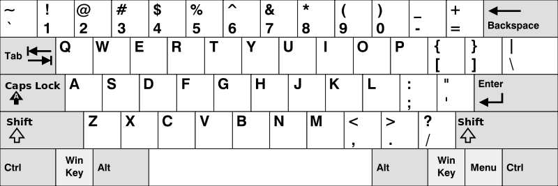

#### 500. Keyboard Row

##### [代码链接](https://github.com/rensuperk/leetCodeStudy/blob/master/src/main/java/KeyboardRow.java)

Given a List of words, return the words that can be typed using letters of alphabet on only one row's of American keyboard like the image below.


American keyboard


Example 1:
```
Input: ["Hello", "Alaska", "Dad", "Peace"]
Output: ["Alaska", "Dad"]
```
Note:
You may use one character in the keyboard more than once.
You may assume the input string will only contain letters of alphabet.


##### 判断是否在一行